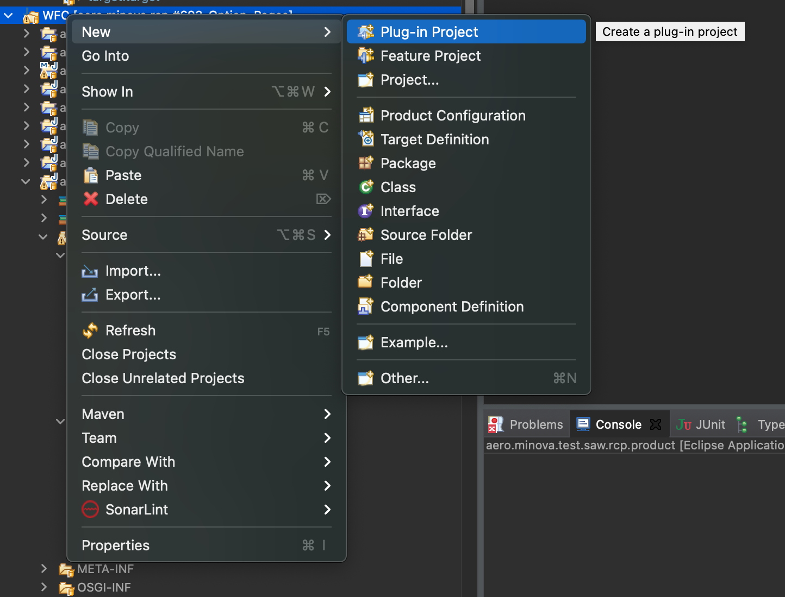
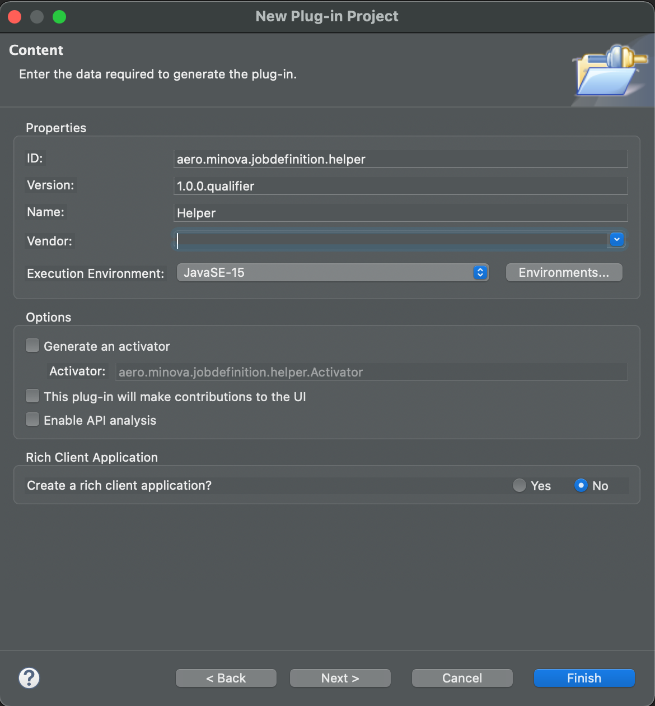
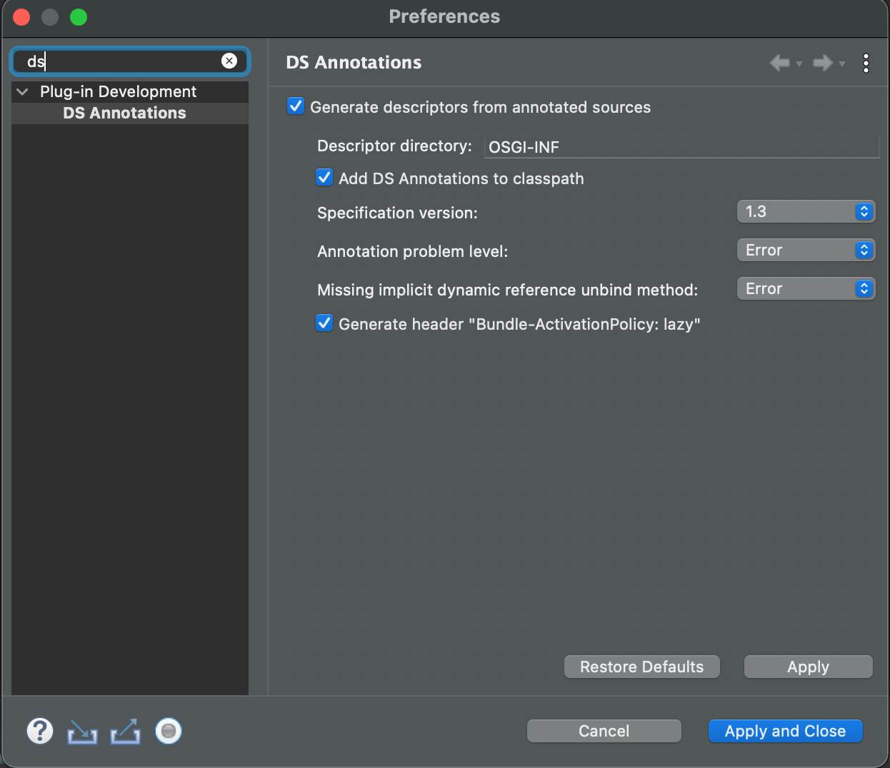
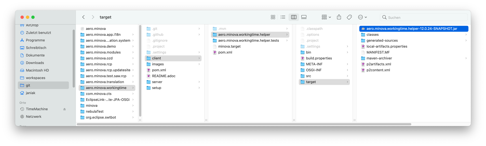

= Erstellen von neuen Plugins

Hier wird das Erstellen von neuen Plugins für Masken der WFC Anwendung dokumentiert. Alle Funktionen, die nicht zu der Core-Anwendung gehören, werden in Plugins ausgelagert. 
Mit der Version 12 wird in Masken kein JavaScript mehr ausgewertet. Die entsprechenden Funktionen müssen ebenfalls in einen Helper ausgelagert werden.

Prinzipiell wird für jede Maske ein eigenes Repository und Plugin erstellt.

Grob müssen folgende Schritte befolgt werden:

1. <<Projekt_erstellen,Erstellen des Projekts>>
2. <<Plugin_erstellen,Erstellen des Plugins>>
3. <<Klasse_erstellen,Erstellen der Klasse>>
4. <<Funktionalitäten,Umsetzen der Funktionalitäten>>
5. <<Bauen,Bauen des Plugins>>
6. <<Ausliefern,Ausliefern/Hochladen aufs CAS>>

Diese Schritte sind im Folgenden genauer beschrieben.

[[Projekt_erstellen]]
== Erstellen des Projekts 

In dem Repository für die Erweiterung muss es einen Ordner `client` geben. In diesem werden die Resourcen für die WFC-Anwendung abgelegt.
Neben den eigentlichen Plugins müssen noch folgende Dateien erstellt werden:

* `.mvn/extensions.xml`
* `minova.target`
* `pom.xml`

Die `.mvn/extensions.xml` Dateil sollte folgenden Inhalt haben:

[source,xml]
----
<extensions>
  <extension>
    <groupId>org.eclipse.tycho.extras</groupId>
    <artifactId>tycho-pomless</artifactId>
    <version>2.4.0</version>
  </extension>
</extensions>
----

Damit braucht nicht jeder Unterordner eine eigene `pom.xml` um mit Maven gebaut werden zu können.

`minova.target` ist die Targetplatform für das Plugin. Um auf Klassen der Core-WFC-Anwendung zugreifen zu können ist folgender Eintrag wichtig:

[source,xml]
----
<location includeAllPlatforms="false" includeConfigurePhase="true" includeMode="planner" includeSource="true" type="InstallableUnit">
	<repository location="https://minova-afis.github.io/aero.minova.rcp.updatesite/"/>
	<unit id="aero.minova.libs.feature.feature.group" version="0.0.0"/>
	<unit id="aero.minova.rcp.feature.feature.group" version="0.0.0"/>
</location>
----

Die komplette Target-Platform des Workingtime-Plugins findet sich link:https://github.com/minova-afis/aero.minova.workingtime/blob/main/client/minova.target[hier].

In der `pom.xml` müssen alle Module vermerkt sein, die gebaut werden sollen. Komplette Datei für Workingtime link:https://github.com/minova-afis/aero.minova.workingtime/blob/main/client/pom.xml[hier].

[source,xml]
----
<modules>
	<module>aero.minova.workingtime.helper</module>
	<module>aero.minova.workingtime.helper.tests</module>
</modules>
----

Beispiel für ein baubares Plugin-Repository:

image:images/projectExample.png[]

Prinzipiell soll es ein eigenes Repositorie für jede Erweiterungen geben (siehe auch link:https://github.com/minova-afis/aero.minova.rcp/issues/749[#749]).
In diesem sind dann neben den Plugins für die WFC-Anwendung auch die Masken, OPs, Übersetzungen, Prozeduren, ... enthalten. Als Beispiel kann man link:https://github.com/minova-afis/aero.minova.workingtime[aero.minova.workingtime] anschauen.

Wenn das gesamte Repository in Eclipse geladen werden soll muss auch der Rootordner selbst eine `.project` Datei enthalten. Diese kann etwa so aussehen:

[source,xml]
----
<?xml version="1.0" encoding="UTF-8"?>
<projectDescription>
	<name>aero.minova.workingtime.root</name>
	<comment></comment>
	<projects>
	</projects>
	<buildSpec>
		<buildCommand>
			<name>org.eclipse.jdt.core.javabuilder</name>
			<arguments>
			</arguments>
		</buildCommand>
		<buildCommand>
			<name>org.eclipse.m2e.core.maven2Builder</name>
			<arguments>
			</arguments>
		</buildCommand>
	</buildSpec>
	<natures>
		<nature>org.eclipse.jdt.core.javanature</nature>
		<nature>org.eclipse.m2e.core.maven2Nature</nature>
	</natures>
</projectDescription>
----

[[Plugin_erstellen]]
== Erstellen des Plugins

In dem client-Ordner des Repositories wird ein neues Plug-In Project erstellt.

Das Namesschema ist `aero.minova.<Klassenname>.helper`.

image:images/pluginDialog1.png[,300,]

=== MANIFEST.MF anpassen

Das Manifest des Plugins muss angepasst werden und sollte dann etwa so aussehen:

image::images/pluginManifest.png[,500,]

* Die Version wird zu Beginn auf 12.0.0 gesetzt. Bei neuen Releases wir die Versionsnummer dann nach üblichem Schema erhöht.
* Der Name wird sinnvoll gefüllt
* Die Checkbox "Activate this plug-in when one of its classes is loaded" wird gesetzt. Dies ist nötig, damit der Helper zur Laufzeit geladen werden kann
* Java-11 wird als Execution Environment eingetragen. *Außerdem muss auch "Update the classpath settings" geklickt werden!* Wir wollen auf Java-17 upgraden sobald verfügbar, wenn das geschehen ist sollte natürlich auch in den Plug-Ins Java-17 verwendet werden.

=== Plugin für Tests

Auch für die Plugins können Tests erstellt werden. 
Dafür wird ein neues Plugin benötigt, das Namensschema ist `aero.minova.<maskenname>.helper.tests`.
Dieses wird dann als Modul in die `pom.xml` eingetragen, damit die Tests beim Bauen automatisch ausgeführt werden.

Bei den Test-Plugins sollte das Manifest ebenfalls entsprechend angepasst werden, vor allem auf die korrekte Java-Version muss geachtet werden.
Da die Tests aber nicht zur Laufzeit wichtig sind muss die Checkbox "Activate this plug-in when one of its classes is loaded" *nicht* gesetzt werden.

[[Klasse_erstellen]]
== Erstellen der Klasse

Damit eine Helperklasse geladen werden kann, muss dies in der zugehörigen Maske vermerkt sein, entweder in der Form am Anfang oder in einem Grid. 
ACHTUNG: Aktuell kann nur ein Helper geladen werden, wenn in der Form und in einem Grid ein Helper vermerkt ist wird der des Grids genutzt.

[source,xml]
----
<!-- Vermerk in form-Tag, am Anfang der Maske -->
<form icon="JobDefinition" title="@tJobDefinition.Administration" 
  helper-class="aero.minova.jobdefinition.helper.JobDefinitionHelper" 
  xmlns:xsi="http://www.w3.org/2001/XMLSchema-instance"
	xsi:noNamespaceSchemaLocation="../../../../../../ch.minova.install/src/ch/minova/install/xsd/XMLForm.xsd">
  ....
</form>

<!-- Vermerk in einem grid-Tag -->
<grid  id="GraduationStep" delete-requires-all-params="true" procedure-suffix="GraduationStep" helper-class="aero.minova.graduation.helper.GraduationStepHelper">
	....
</grid>
----

Die Helperklassen müssen die Klasse ``IHelper`` implementieren. Dafür muss das Package ``aero.minova.rcp.model`` zu den benötigten Plug-Ins hinzugefügt werden.

[source,java]
----
package aero.minova.jobdefinition.helper;

import aero.minova.rcp.model.form.MDetail;
import aero.minova.rcp.model.helper.ActionCode;
import aero.minova.rcp.model.helper.IHelper;

@Component
public class JobDefinitionHelper implements IHelper {

	@Override
	public void setControls(MDetail mDetail) {
		// TODO Auto-generated method stub
	}

	@Override
	public void handleDetailAction(ActionCode code) {
		// TODO Auto-generated method stub
	}
}
----

=== Methoden

In der ``setControls`` Methode wird das MDetail übergeben, dass unter anderem alle Felder und Grids enthält. Dieses sollte als lokale Variable gespeichert werden.

Die ``handleDetailAction`` Methode wird aufgerufen, wenn von dem/der Nutzer:in eine Aktion ausgefürt wird. Diese sind im nächsten Abschnitt erklärt.

=== Laden zur Laufzeit

Außerdem wird an die Klassen `@Component` geschrieben. 
Dies wird benötigt, damit der Helper zur Laufzeit geladen werden kann.
Sobald mit diesem `@Component` gespeichert wird sollte automatisch ein Ordner `OSGI-INF` erstellt werden, der eine XML Datei enthält. 
Sollte dies nicht geschehen kann es über die Einstellungen aktiviert werden:

Das Manifest sollte automatisch um einen `Service-Component`-Eintrag erweitert worden sein (zu finden in der Sourcecode-Darstellung, MANIFEST.MF).
Der Ordner `OSGI-INF` sollte jetzt noch zu dem Build hinzugefügt werden (`Manifest -> Tab "Build"`).

=== Programmieren des neuen Helpers

Damit der neue Helper entwickelt werden kann, ohne dass dieser erst gebaut und auf dem CAS ausgeliefert werden muss sind folgende Schritte nötig:

* In der Debug Configuration -> Tracing -> aero.minova.rcp.dataservice -> debug/uselocalhelper aktivieren
* Das neue Plugin in die Debug-Configuration von Eclipse aufnehmen, damit die lokale Version genutzt wird (kleiner Pfeil neben Debug-Icon -> Plug-ins -> entsprechendes Plug-in auswählen)

[[Funktionalitäten]]
== Umsetzen von Funktionalitäten

Alle Helper liegen im Kontext, es ist also möglich Injection zu nutzen.

Über das MDetail kann auf die Felder und Grids zugegriffen werden. Dies funktioniert jeweils über den Feldnamen (Achtung bei OPs, die Felder heißen ``<opTitel>.<Feldname>``):

[source,java]
----
MField startDate = mDetail.getField("StartDate");
----

=== Reagieren auf Detail-Aktionen

Beim Betätigen einer Aktion im Detail wird automatisch die Methode ``handleDetailAction`` aufgerufen. Mögliche Aktionen sind:

* BEFORE-/ AFTERDEL: Vor/Nach dem Löschen eines Eintrages
* BEFORE-/ AFTERNEW: Vor/Nach Erstellen eines neuen Eintrags, also leeren der Felder. Da hier keine Prozedur aufgerufen wird folgen die Events kurz nacheinander
* BEFORE-/ AFTERSAVE: Vor/Nach dem Speichern/Updaten eines Eintrages
* BEFORE-/ AFTERREVERT: Vor/Nach dem Zurücksetzten des Eintrages. Auch hier wird keine Prozedur aufgerufen
* BEFORE-/ AFTERREAD: Vor/Nach dem Lesen eines Datensatzes, Achtung: AFTERREAD wird verschickt, sobald die HAUPT-Maske komplett geladen ist. Option Pages und Grids sind eventuell noch nicht geladen

ACHTUNG bei den Aktionen VOR Löschen/Speichern/Lesen/..., die Aufrufe sind asynchron, es wird also nicht auf eine Antwort des Helpers gewartet bevor die eigentlichen Prozeduren ausgeführt werden. 

Wenn für die Aktion eine Prozedur aufgerufen wird erfolgt das AFTER-Event nur nach erfolgreichem Durchführen dieser.

=== Belegen von Werten in Feldern

Einzelne Felder können aus dem ``MDetail`` geholt und über die ``setValue`` Methode mit Werten belegt werden. Dabei ist darauf zu achten, dass als Wert ein ``Value``-Objekt zu verwenden ist, und der Datentyp zu dem Feld passen muss. Das ist besonders wichtig für ``Lookup``-Values. Als Nutzer wird ``false`` angegeben.

[source,java]
----
// Feld "startDate" mit aktuellem Datum belegen
MField startDate = mDetail.getField("StartDate");
startDate.setValue(new Value(DateUtil.getDate("0")), false);

// Versuchen, das Feld employee mit dem Lookup-Value für "janiak" vorzubelegen
MLookupField employee = (MLookupField) mDetail.getField("EmployeeKey");
LookupValueAccessor va = (LookupValueAccessor) employee.getValueAccessor();
CompletableFuture<List<LookupValue>> valueFromAsync = va.getValueFromAsync(null, "janiak");
valueFromAsync.thenAccept(l -> Display.getDefault().asyncExec(() -> {
  if (!l.isEmpty()) {
    LookupValue employeeValue = l.get(0);
    employee.setValue(employeeValue, false);
  }
}));
----

==== Dirty-Flag

Damit das Dirty-Flag richtig funktioniert müssen die vorbelegten Werte ans WFCDetailCASRequestsUtil geliefert werden. Dies funktioniert in Form einer Tabelle:

[source,java]
----
// Vorbelegte Werte werden für das DirtyFlag ans WFCDetailCASRequestUtil geliefert
Table table = new Table();
table.setName("WorkingTime");
Row r = new Row();

employee.setValue(employeeValue, false);
table.addColumn(new Column(employee.getName(), employee.getDataType()));
r.addValue(employeeValue);

bookingDate.setValue(new Value(DateUtil.getDate("0")), false);
table.addColumn(new Column(bookingDate.getName(), bookingDate.getDataType()));
r.addValue(bookingDateValue);

t.addRow(r);
WFCDetailCASRequestsUtil casUtil = mPerspective.getContext().get(WFCDetailCASRequestsUtil.class);
casUtil.setSelectedTable(t);

broker.post(Constants.BROKER_CHECKDIRTY, ""); // Check über IEventBroker anstoßen
----

=== Belegen von Werten in Grids

Einzelne Werte in Grids können direkt in die zugrundeliegende Tabelle gesetzt werden, das Grid wird automatisch aktualisiert.
Die Klasse ``aero.minova.rcp.model.Table`` enthält einige Methoden die das Setzen von Werten weiter vereinfachen, etwa kann statt dem Spaltenindex auch der Spaltenname angegeben werden.

[source,java]
----
//setValue(int columnIndex, int rowIndex, Value newValue)
mDetail.getGrid("InvoicePosition").setValue(4, 5, new Value("neuer Wert"))
----

Um ganze Zeilen hinzuzufügen wird eine Tabelle verwendet. 
Die Spaltennamen in der übergebenen Tabelle müssen mit denen des Grids übereinstimmen, da diese genutzt werden um die Werte an die richtige Stelle zu schreiben.
Die Reihenfolge der Spalten muss also NICHT übereinstimmen und es muss auch nicht die gleiche Anzahl sein. 
Wenn eine Spalte des Grids in der übergebenen Tabelle nicht gefunden wurde bleibt die entsprechende Zelle im Grid leer.

[source,java]
----
mDetail.getGrid("InvoicePosition").addRows(tableWithNewRows);
----

Wenn die Daten eines Grids komplett ersetzt werden sollen und auch das Dirtyflag nicht anspringen soll muss das Setzen über die Klasse ``WFCDetailCASRequestsUtil`` geschehen. 
Wie für die Zeilen müssen die Spaltennamen übereinstimmen, Reihenfolge ist aber egal.

[source,java]
----
WFCDetailCASRequestsUtil casUtil = mPerspective.getContext().get(WFCDetailCASRequestsUtil.class);
casUtil.setGridContent(mDetail.getGrid("InvoicePosition"), newDataTable);
----

=== Grids Validieren

Es ist möglich, Eingaben in Grids direkt zu validieren. 
Dafür muss eine Klasse das Interface ``IGridValidator`` implementieren.
Über die Methode ``MGrid#addValidation(IGridValidator validator, List<Integer> columnsToValidate)`` wird die Validierung hinzugefügt.

Die Methode ``checkValid()`` wird genutzt, um ungültige Zellen rot zu färben und das Speichern zu verhindern.

Mit ``validateThrowingException()`` wird die Eingabe überprüft, bevor sie ins Grid eingetragen wird. 
Bei dem Aufruf steht der neue Wert also noch nicht in der Tabelle!
Wenn der neue Wert nicht gültig ist, muss eine ``ValidationFailedException`` geworfen werden. 
Deren Text wird übersetzt und als Notification-Popup unten links angezeigt.

Die Spalten- und Zeilenindices entsprechen den Positionen in der Tabelle, die dem Grid zugrunde liegt.
Auf die Werte kann also wie gewohnt über das MGrid zugegriffen werden.

Die beiden Methoden werden nur für Werte aufgerufen, die in einer Spalte stehen deren Index in den ``columnsToValidate``steht.
Hier sollte darauf geachtet werden, dass die meisten Grids unsichtbare Spalten haben, in denen die Keys stehen, die nicht validiert werden sollten.

In dem folgenden Beispiel werden die Werte der Spalte 2 (eine Integer Spalte) darauf überprüft, ob sie kleiner als 10 sind:

[source,java]
----
@Component
public class GraduationStepHelper implements IHelper, IGridValidator {

	private MGrid graduationSteps;

	@Override
	public void setControls(MDetail mDetail) {
		graduationSteps = mDetail.getGrid("GraduationStep");
		List<Integer> columnsToValidate = List.of(2); // Es soll nur Spalte 2 überprüft werden
		graduationSteps.addValidation(this, columnsToValidate); 
	}

	@Override
	public void handleDetailAction(ActionCode code) {
		// Es werden nur Einträge ins Grid überprüft, nicht die Aktionen
	}

	@Override
	public boolean checkValid(int columnIndex, int rowIndex) {
		return graduationSteps.getDataTable().getValue(columnIndex, rowIndex).getIntegerValue() <= 10;
	}

	@Override
	public void validateThrowingException(int columnIndex, int rowIndex, Object newValue) throws ValidationFailedException {
		if ((Integer) newValue > 10) {
			throw new ValidationFailedException("Wert darf nicht größer als 10 sein!");
		}
	}
}
----

=== Reagieren auf Wert-Änderungen 

Um auf Wertänderungen reagieren zu können muss eine Klasse den ``ValueChangeListener`` bzw. den ``GridChangeListener`` implementieren.
Diese Klasse kann dann als Listener zu einem Feld oder Grid hinzugefügt werden um auf Wertänderungen zu reagieren.

[source,java]
----
TicketHelper ticketHelper = new TicketHelper(this);
mDetail.getField("OrderReceiverKey").addValueChangeListener(ticketHelper);

public class TicketHelper implements ValueChangeListener {
	@Override
	public void valueChange(ValueChangeEvent evt) {
		MLookupField lookupField = (MLookupField) evt.getField();
		String writtenText = lookupField.getWrittenText();
		if (writtenText != null && writtenText.startsWith("#")) {
				System.out.println("Eingegbenes Ticket: " + writtenText);
		}
	}
}
----

==== GridChangeEvent

Es gibt vier verschiedene Typen von GridChangeEvents. 
Jedes GridChangeEvent hat einen GridChangeType und entsprechend sind die Attribute (nicht) gesetzt.

* RESET: Die Tabelle wurde komplett geändert (z.B. nach dem Laden eines neuen Datensatzes)
* INSERT: Eine neue Zeile wurde ins Grid eingefügt. Der Index der neuen Zeile wird mitgegeben
* DELETE: Eine Zeile des Grids wurde gelöscht. Der Index den die alte Zeile hatte wird mitgegeben
* UPDATE: Ein einzelner Wert im Grid wurde geändert. Zeilen- und Spaltenindex sowie der alte und neue Wert wird mitgegeben

=== Buttons

In Version 11 konnten Buttons über die Maske de-/aktiviert werden, je nachdem ob ein gewisses Feld einen Wert hat:

[source,xml]
----
<!-- Alte Maske -->
<button icon="Print.Command" text="@Action.PrintInvoice" id="PrintInvoice">
       <dynamic property="enabled">KeyLong != null</dynamic>
</button>
----

Da wir kein JavaScript mehr in der Maske wollen kann der entsprechende Code etwa wie folgt aussehen. 
Damit der Button immer aktuell bleibt sollte das De-/Aktivieren mit einem ValueChangeListener auf das entsprechende Feld verbunden werden.

[source,java]
----
MField keyLong = mDetail.getField("KeyLong");
MButton printInvoice = mDetail.getButton("PrintInvoice");
printInvoice.setEnabled(keyLong.getValue() != null);
----

Außerdem muss ein Helper auf das Drücken eines Buttons reagieren können. 
Dafür kann ein `SimpleSelectionAdapter` auf den Button registriert werden:

[source,java]
----
MButton printInvoice = mDetail.getButton("PrintInvoice");
printInvoice.addSelectionListener(new SimpleSelectionAdapter() {
	@Override
	public void handle(SelectionEvent e) {
		// Entsprechende Methode(n) ausführen
	}
});
----

=== Ein-/Ausblenden von Sections

In Version 11 konnten einzelne Sections über die Maske ein- oder ausgeplendet werden.

[source,xml]
----
<!-- Alte Maske -->
 <page id="Debug" text="@Administration" icon="Administration" visible="false">
    <dynamic property="visible">app.isSUMode()</dynamic>
    ...
</page>
----

Auch dies wird in Version 12 über einen Helper umgesetzt.
Vorerst gibt es keinen Super User Modus mehr, stattdessen können versteckte Abschnitte über die Einstellungen eingeblendet werden ("Darstellung" Tab, die Einstellung hat ID `ApplicationPreferences.SHOW_HIDDEN_SECTIONS`).
Die Umsetzung im Helper kann dann wie folgt aussehen:

[source,java]
----
//Preferences laden
IEclipsePreferences preferences = InstanceScope.INSTANCE.getNode(ApplicationPreferences.PREFERENCES_NODE);

//MSection über ihre ID aus dem MDetail holen
MSection debugSection = mDetail.getPage("Debug");

// Initial Sichtbarkeit entsprechend der Einstellung setzten
debugSection.setVisible(preferences.getBoolean(ApplicationPreferences.SHOW_HIDDEN_SECTIONS, false));

// Bei einer Änderung der Einstellung Sichtbarkeit anpassen
preferences.addPreferenceChangeListener(event -> {
	if (event.getKey().equals(ApplicationPreferences.SHOW_HIDDEN_SECTIONS)) {
		debugSection.setVisible(event.getNewValue().equals("true"));
	}
});
----

=== Felder und Grids auf read-only oder required

Felder und Grids können über die Helper auf read-only oder required gesetzt werden. Das Verhalten (kein Speichern ohne Value bei required und kein Bearbeiten von read-only Feldern) sowie die Darstellung wird automatisch angepasst.
In Grids können aktuell nur ganze Spalten geändert werden.
Für Grids gibt es die Möglichkeit, das ganze Grid auf einmal zu ändern.
Zudem bietet das MDetail Methoden, mit dem alle Felder oder alle Felder und Grids auf einmal angepasst werden können.
Auch das Zurücksetzen auf den Originalzustand (wie in der Maske definiert) ist möglich.

[source,java]
----
// Felder
mDetail.getField("Description").setReadOnly(true);
mDetail.getField("Description").setRequired(true);
mDetail.getField("Description").resetReadOnlyAndRequired();

// Grids, äquivalent für required möglich
mDetail.getGrid("InvoicePosition").setColumnReadOnly(4, true);
mDetail.getGrid("InvoicePosition").setGridReadOnly(true);
mDetail.getGrid("InvoicePosition").resetReadOnlyAndRequiredColumns();

// Über mDetail alle Felder / Grids ändern
mDetail.setAllFieldsReadOnly(true);
mDetail.setAllGridsAndFieldsReadOnly(true);
mDetail.resetAllGridsAndFieldsReadOnlyAndRequired();
----

=== Param-String Felder

In der alten Version wurden die Felder, die in Param-String Feldern dargestellt werden über JavaScript in der Maske gesetzt:

[source,xml]
----
<!-- Alte Maske -->
<jscript>
	tools.setProp('ExecutionParameter', 'xml-file', 'SQL2FileParameter.op.xml');
</jscript>
----

In Version 12 muss dies über einen Helper geschehen, indem die entsprechende Methode der Klasse ``WFCDetailCASRequestsUtil`` aufgerufen wird.
Wenn noch nicht geschehen wird die Maske automatisch runtergeladen und ausgelesen, die entsprechenden Felder werden im Detail erstellt.
Der äquivalente Code kann so aussehen:

[source,java]
----
WFCDetailCASRequestsUtil casUtil = mPerspective.getContext().get(WFCDetailCASRequestsUtil.class); 
casUtil.updateParamStringField((MParamStringField) mDetail.getField("ExecutionParameter"), "SQL2FileParameter.op.xml");
----

=== tools.getSQLValue() Methode 

In der alten Version wurden über JavaScript Werte aus der Datenbank geholt:

[source,xml]
----
<!-- Alte Maske -->
<jscript>
	tools.getSQLValue('vJobDefinitionParameter', 'JobExecutorKey', JobExecutorKey, 'ClassName');
</jscript>
----

Dies kann in der neuen Version wie folgt abgebildet werden (Der ``IDataService`` kann injected werden):

[source,java]
----
Value jobExecuterKey = mDetail.getField("JobExecutorKey").getValue();
dataService.getSQLValue("vJobDefinitionParameter", "JobExecutorKey", jobExecuterKey, "ClassName", mDetail.getField("ClassName").getDataType());
----

Die Methode getSQLValue() nimmt folgende Parameter:

* String tablename: der Name der angefragten Tabelle/ View
* String requestColumn: der Name der Spalte für die der Wert gegeben ist
* Value requestValue: der Wert nach dem gesucht werden soll (in der gegebenen Spalte)
* String resultColumn: der Name der Spalte, für die der Wert zurückgegeben werden soll
* DataType resultType: der Typ des angefragten Werts

=== Filtern von Optionen für Lookup Felder

Manchmal kann es gewünscht sein, dass für Lookup-Felder nicht alle Optionen, die von der Datenbank geliefert werden, auch angezeigt werden.
Entsprechend kann Lookup Feldern ein Filter gegeben werden.
Dieser muss von die Klasse ``Predicate<LookupValue>`` haben.
In dem Beispiel wird das LookupValue mit KeyText "AUTOCREDIT" aus den angezeigten Optionen entfernt.

[source,java]
----
MLookupField invoiceTypeKey = (MLookupField) mDetail.getField("InvoiceTypeKey");
invoiceTypeKey.setFilterForContentProvider(value -> !value.getKeyText().equals("AUTOCREDIT"));
----

=== SiteParameter anfragen

Auch in Version 12 gibt es eine Tabelle ``tSiteParameter``.
Deren Werte können über den ``IDataService`` (der injected werden kann) angefragt werden. 
Als Parameter wird der Key sowie der Defaultwert (falls der Key nicht existiert) benötigt.
Es wird immer ein String zurückgegeben.

[source,java]
----
String defaultCurrency = dataService.getSiteParameter("InvoiceDefaultCurrency", "2");
----

=== Ausführen von Handlern (z.B. zum Speichern)

Alle Handler können auch aus dem Code aufgerufen werden. 
Dafür müssen der ``ECommandService`` und der ``EHandlerService`` injected werden.
Wenn die ``canExecute()`` Methode des jeweiligen Handlers false zurückgibt wir der Handler auch nicht ausgeführt.

[source,java]
----
//Beispielhafes Ausführen des Handlers zum Speichern des Details
String commandID = Constants.AERO_MINOVA_RCP_RCP_COMMAND_SAVEDETAIL
ParameterizedCommand cmd = commandService.createCommand(commandID, null);
handlerService.executeHandler(cmd);
----

=== Benachrichtigungen an Nutzer:in

Es gibt prinzipiell zwei Möglichkeiten, Nachrichten anzeigen zu lassen. 
Zum einen kann ein kleines Popup erstellt werden, das auch ohne Interaktion wieder verschwindet. 
Die andere Möglichkeit ist als Fehlermeldung, die aktiv weggeklickt werden muss.

Beide Methoden werden über den ``IEventBroker`` aufgerufen.
Der Nachrichtstring wird automatisch übersetzt, ob mit oder ohne "@" am Anfang.

[source,java]
----
broker.send(Constants.BROKER_SHOWNOTIFICATION, "msg.notification"); // Popup
broker.send(Constants.BROKER_SHOWERRORMESSAGE, "msg.errormessage"); // Fehlermeldung
----

=== Maskenspezifische Einstellungen

Es ist möglich, für eine Masken ein zusätzliches Tab in den Einstellungen hinzuzufügen (z.B. um den/die Mitarbeiter:in in der Stundenerfassung vorzubelegen). 
Dafür muss eine neue Klasse definiert werden, die die Klasse ``PreferenceTabDescriptor``erweitert.
Das verwendete Icon muss aktuell im ``icons`` Ordner des ``aero.minova.rcp.preferencewindow``-Plugins liegen.
In dem Beispiel ist auch gezeigt, wie man an den TranslationService kommt.
Die Einstellungen werden dann wie auch die Haupteinstellungen aufgebaut, siehe auch Klasse ``PreferenceWindowModel``.
Auf die eingestellten Werte kann dann wie für alle anderen Einstellungen auch zugegriffen werden.

[source,java]
----
public class WorkingTimePreferencePage extends PreferenceTabDescriptor {

	public WorkingTimePreferencePage() {
		super("aero.minova.rcp.preferencewindow", "icons/SIS.png", "sisTab", getTranslationService().translate("@Preferences.WorkingTime", null), 0.6);
		
		TranslationService translationService = getTranslationService();
		
		PreferenceSectionDescriptor psd;
		psd = new PreferenceSectionDescriptor("user", translationService.translate("@Preferences.WorkingTime.UserPreselect", null), 0.1);
		this.add(psd);
		psd.add(new PreferenceDescriptor(Constants.USER_PRESELECT_DESCRIPTOR,
				translationService.translate("@Preferences.WorkingTime.UserPreselectDescription", null), 0.1, DisplayType.STRING,
				System.getProperty("user.name")));
	}

	/**
	 * Translation Service aus dem Kontext holen
	 */
	private static TranslationService getTranslationService() {
		IEclipseContext serviceContext = EclipseContextFactory.getServiceContext(FrameworkUtil.getBundle(WorkingTimePreferencePage.class).getBundleContext());
		return serviceContext.get(IWorkbench.class).getApplication().getContext().get(TranslationService.class);
	}
}
----

Wenn die Klasse erstellt ist muss sie noch in der ``Manifest.MF`` Datei eingetragen werden. 
Unter ``Extensions`` wird ``minova.preferencepage`` ausgewählt und die eben erstellte Klasse wird als page eingetragen. 
Atomatisch wird ein ``plugin.xml`` file erstellt, das folgenden Inhalt haben sollte (als Klasse natürlich die eben erstellte):

[source,xml]
----
<plugin>
   <extension
         point="minova.preferencepage">
      <page
            class="aero.minova.workingtime.preferencepage.WorkingTimePreferencePage">
      </page>
   </extension>
</plugin>
----

[[Bauen]]
== Bauen des Plugins

Das Plugin kann gebaut werden, indem der `mvn clean verify` Befehl in dem `client` Ordner des entsprechenden Repositories ausgeführt wird. Das gebaute .jar File liegt dann im `target`-Ordner des jeweiligen Plugins.

Alternativ kann auch ein Github-Workflow angelegt werden, der zusätzlich zum Bauen einen Tag und Release erstellt. Beispiel für Workingtime link:https://github.com/minova-afis/aero.minova.workingtime/blob/main/.github/workflows/tagAndRelease.yml[hier].

Dieser kann dann über ``Actions -> Tag and Release Workingtime - PlugIn`` automatisch ausgeführt werden.

image::images/automaticRelease.png[]

Das .jar File ist dann im Release als Asset verfügbar.

[[Ausliefern]]
== Ausliefern/Hochladen aufs CAS

Das gebaute .jar muss vom CAS zur Verfügung gestellt werden.

Zuerst verbindet man sich mit dem System, auf welchem der CAS läuft.
Dort sucht man das Verzeichnis Minova bzw. Minova Systems und wählt in diesem das gewünschte Projekt aus.
Von dort aus navigiert man zu Shared Data\Program Files\SIS\plugins.
Im Plugins Ordner legt man dann einfach die .jar ab.
Zum Schluss muss nur noch das CAS neu gestartet werden, damit ein neues ZIP erzeugt wird, in welchem das neue Plugin vorhanden ist.
