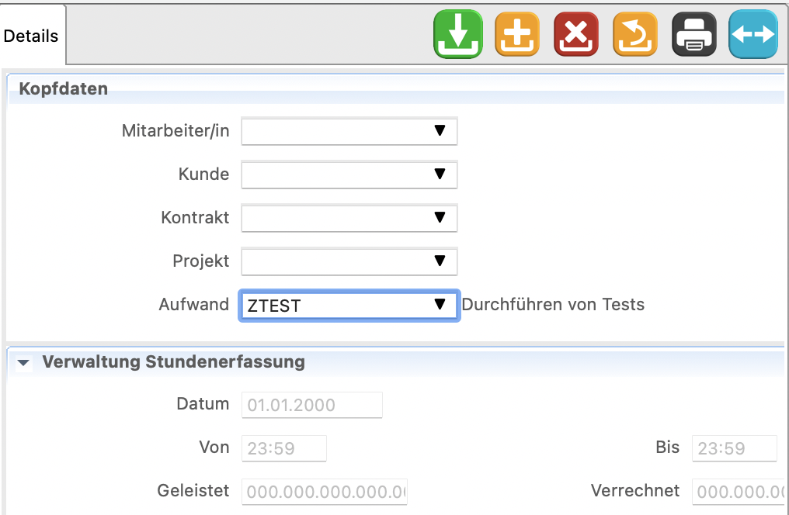
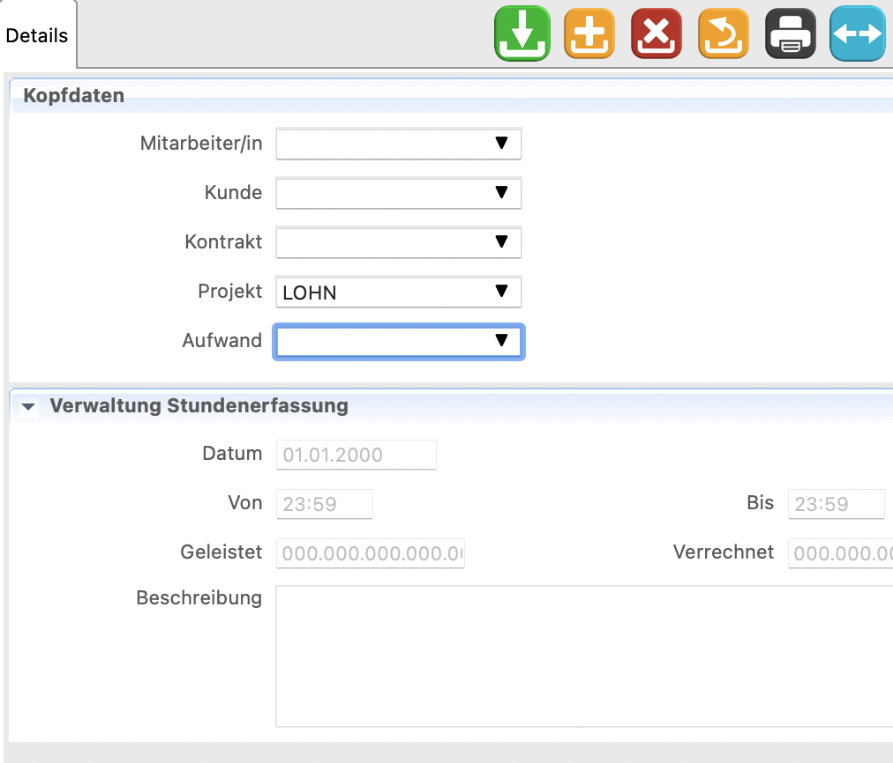
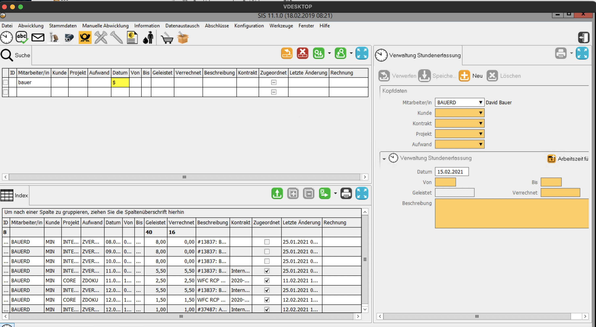
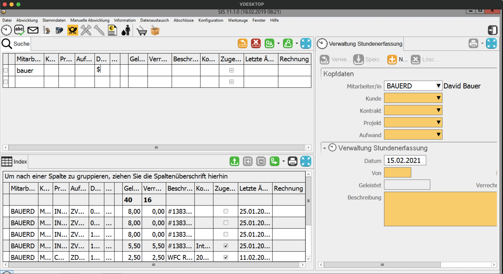
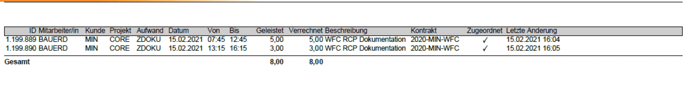
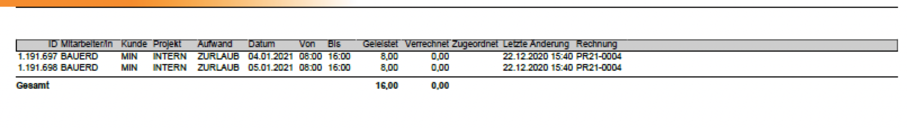
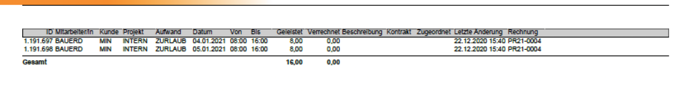

= Anwendungs Preferences

Dokumentation der standard Preferences für die Anwendung, die nicht spezifisch zu einer der Anwendungen(SIS, DISPO, TTA, AFIS) gehören. Die Werte der Preferences werden im Instance Scope des Workspaces gespeichert. 

==== Anwendungs Tab

===== Lizenz Warnung

Bestimmt den Zeitraum vor einer Linzenz Warnung in Wochen.

[%hardbreaks]

===== Standard Workspace

Zeigt das eingestellte Standard Workspace an und ermöglicht dieses zurückzusetzen
	
Das Workspace "test" wurde als standard Workspace eingestellt:
image::images/workspace_default_set.png[Das ist die Bildbeschreibung,550,300]

[%hardbreaks]

===== Nach dem Betätigen von ENTER wird das erste erforderliche Feld selektiert

Fall True (Default):
Der eingetragene oder ausgewählte Wert wird festgesetzt und der Benutzer springt ins erste Pflichtfeld der Maske.

Position vor dem Betätigen von ENTER:

Position nach dem Betätigen von ENTER mit EnterSelectsFirstRequired = true:

image::images/enter_selects_first_required_true.png[Position nach drücken von ENTER bei der Option true,550,300]

[%hardbreaks]
	 
Fall False:
Der eingetragene oder ausgewählte Wert wird festgesetzt und der Benutzer springt ins nächste Pflichtfeld.

Position vor dem Betätigen von ENTER:

Position nach dem Betätigen von ENTER mit EnterSelectsFirstRequired = false:

image::images/enter_selects_first_required_false.png[Position nach drücken von ENTER mit der Option false,550,300]

[%hardbreaks]

===== Das Betätigen von Enter in einer Auswahlbox bewirkt die Übernahme des ausgewählten Wertes. Nach der Übernahme wird das nächste erforderliche Feld selektiert

Fall True (Default):
Der in der LookupComboBox ausgewählte Wert wird festgesetzt und der Benutzer springt ins nächste Pflichtfeld.

Position vor dem Betätigen von ENTER im LookupControl:

image::images/lookup_enter_selects_next_required_start.png[Start,550,300]

Position nach dem Betätigen von ENTER im LookupControl mit LookupEnterSelectsNextRequired = true:

Fall False:
Der in der LookupComboBox ausgewählte Wert wird festgesetzt und der Benutzer bleibt im Feld.

Position vor dem Betätigen von ENTER im LookupControl:

image::images/lookup_enter_selects_next_required_start.png[Start,550,300]

Position nach dem Betätigen von ENTER im LookupControl mit LookupEnterSelectsNextRequired = false:

image::images/lookup_enter_selects_next_required_false.png[False,550,300]

[%hardbreaks]

===== Aktiviert die Selektion aller möglichen Felder inkl. Registerkarte und Schaltflächen

Fall True (Default):
Der Benutzer kann mit TAB in die Controls(Speichern, Neu, ...) navigieren.

Position vor dem Betätigen von TAB:

image::images/select_all_controls_start.png[Start,550,300]

Position nach dem Betätigen von TAB mit SelectAllControls = true:

image::images/select_all_controls_true.png[True,550,300]
	
Fall False:
Der Benutzer kann mit TAB nicht in die Controls(Speichern, Neu, ...) navigieren.
	 
Position vor dem Betätigen von TAB:

image::images/select_all_controls_start.png[Start,550,300]

Position nach dem Betätigen von TAB mit SelectAllControls = false:

image::images/select_all_controls_false.png[False,550,300]

[%hardbreaks]

==== Darstellungs Tab

===== Landessprache

Bestimmt die Sprache der Anwendung.

[%hardbreaks]

===== Land

Bestimmt das Land, das für das Locale genutzt wird.

[%hardbreaks]

===== Zeitzone

Bestimmt die Zeitzone des Anwenders. Der Server arbeitet immer in der Zeitzone UTC.

[%hardbreaks]

===== Schriftgröße

Bestimmt die Schriftgröße der Anwendung.

Schriftgröße ist auf M gesetzt:

Schriftgröße ist auf L gesetzt:

[%hardbreaks]

===== Datums-/Zeitformat

===== Date Pattern

Das Pattern bestimmt die Formatierung des Datums. Dabei bestimmt dieses nur die Darstellung des Datums, aber nicht die Reihenfolge von Tag, Monat und Jahr. 

**Beispiel:**
|===
| **Pattern** | **Eingabe** | **Ausgabe**
| dd.MM.y | 120220 | 12.02.2020
| dd/MMM/yy | 120220 | 12/Feb./20
| MM.dd.yyyy | 120220 | 12.02.2020
|===

Die Message im Text Feld, stellt das Standard Pattern für das ausgewählte Locale da.

===== Time Pattern

Das Pattern bestimmt die Formatierung der Zeit. Dabei bestimmt die Eingabe nicht nur die Darstellung, sondern auch, ob das 12-Stunden oder das 24-Stunden Format verwendet wird.
Bei dem Pattern mit kleinem **h** wird das 12-Stunden Format verwendet und bei großen **H** wird das 24-Stunden Format verwendet. **Beachten: Wenn im Pattern kein a hinzugefügt wird, wird AM/PM nicht mit dargestellt!!**
Das AM/PM wird in die entsprechende Sprache übersetzt.

**Beispiel:**
|===
| **Pattern** | **Eingabe** | **Ausgabe**
| hh:mm | 2345 | 11:45
| hh:mm a | 2345 | 11:45 PM
| HH:mm | 2345 | 23:45
| H:mm | 726 | 7:26
| HH:mm | 726 | 07:26
|===

Die Message im Text Feld, stellt das Standard Pattern für das ausgewählte Locale da.

===== Experten Modus - Zeige versteckte Abschnitte an

Manche Abschnitte sind nur sichtbar, wenn diese Option gewählt ist. 
Das ein-/ausblenden wird über die Helper der einzelnen Masken geregelt.
Ersatz für Teil des SuperUser Modus von Version 11.

==== Erweitert Tab

===== Index beim Öffnen der Maske automatisch laden

Die Daten im Index werden beim Öffnen der Maske automatisch geladen.

[%hardbreaks]

===== Index automatisch nach dem Speichern aktualisieren
	
Der Index wird nach dem Speichern automatisch aktualisiert.

[%hardbreaks]

===== Meldungsfenster an Menüleiste

Das Meldungsfenster für Fehler wird an die Menüleiste angebunden.

[%hardbreaks]

===== Beschreibung für Schaltflächen einblenden

Blendet den Text von Schaltflächen in den Toolbars ein.

Schaltflächen in den Toolbars mit ShowButtonText = false:

image::images/show_button_text_false.png[false,550,300]

Schaltflächen in den Toolbars mit ShowButtonText = true:

image::images/show_button_text_true.png[true,550,300]

===== TODO: Masken Puffer benutzen

===== Nachricht bei ungespeicherten Änderungen anzeigen

Zeigt eine Nachricht an, wenn ungespeicherte Änderungen durch das Laden eines Datensatzes im Index verworfen werden.

===== Bestätigungsdialog vor Löschen

Zeigt einen Bestätigungsdialog an, bevor ein Datensatz gelöscht wird. Der Default-Wert für diese Einstellung wird aus der XBS ausgelesen (ShowDeleteDialog).
Die Entscheidung der Nutzer übertrifft aber die XBS-Einstellung.

[%hardbreaks]

===== Anzeige Puffer [ms]

Bestimmt die Zeit, die die Anwendung wartet bevor sie den Detail Bereich aktualisiert .

[%hardbreaks]

===== Max . Puffer [ms]

Bestimmt den Puffer in dem die Anwendung Zwischenänderungen sichtbar macht, während der Anzeige-Puffer noch nicht abgelaufen ist.

[%hardbreaks]

===== Auswahlverzögerung [ms]

Bestimmt die Dauer, die bei einer Auswahl gewartet wird, bevor das Event gesendet wird. Zum Beispiel, wenn man mit den Pfeiltasten 
durch die Tabelle geht, wird nicht bei jeder Auswahl das Event gesendet, sondern nur, wenn in dem angegebenen Zeitraum die Auswahl 
nicht geändert wurde.

[%hardbreaks]

===== Zeit vor Timeout [s]

Bestimmt die Dauer bevor eine Anfrage an den Server als nicht erfolgreich angesehen wird.

===== Zeit vor "Warten auf Daten" Hinweise [s]

Bestimmt die Dauer, bevor eine Meldung angezeigt wird, dass gerade Daten geladen werden.

==== Drucken Tab

===== XML + XSL erstellen

Erstellt beim Drucken neben einem PDF auch eine eine XML und XSL Datei im gleichen Ordner.

[%hardbreaks]

===== Schriftart Inhaltsverzeichnis

Bestimmt die Schriftart des Inhaltsverzeichnisses beim Drucken.

[%hardbreaks]

===== Breiten optimieren

Optimiert die Breiten der Spalten beim Drucken.

Druckvorschau im Index mit OptimizeWidth = true:

Druckvorschau im Index mit OptimizeWidth = false:

image::images/optimize_width_false.png[False,650,200]

[%hardbreaks]

===== Leere Spalten verbergen

Verbirgt beim Drucken die leeren Spalten. 

Druckvorschau im Index mit HideEmptyCols = true:

Druckvorschau im Index mit HideEmptyCols = false:

[%hardbreaks]

===== Gruppenspalten verbergen

Verbirgt beim Drucken die Spalten, die die Gruppen bilden.

Druckvorschau im Index mit HideGroupCols = true:

image::images/hide_group_cols_true.png[True,650,200]

Druckvorschau im Index mit HideGroupCols = false:

image::images/hide_group_cols_false.png[False,650,200]

[%hardbreaks]

===== Suchkriterien verbergen

Verbirgt beim Drucken die Suchkriterien.

Druckvorschau im Index mit HideSearchCriterias = true:

image::images/hide_search_criterias_true.png[True,650,200]

Druckvorschau im Index mit HideSearchCriterias = false:

image::images/hide_search_criterias_false.png[False,650,200]

[%hardbreaks]

===== Interne Vorschau verbergen

Deaktiviert die interne Druckvorschau.

[%hardbreaks]

==== Konsole

===== Max . Zeichen

Bestimmt die maximal Anzahl an Zeichen in der Konsole. Die ältesten Einträge werden abgeschnitten.
