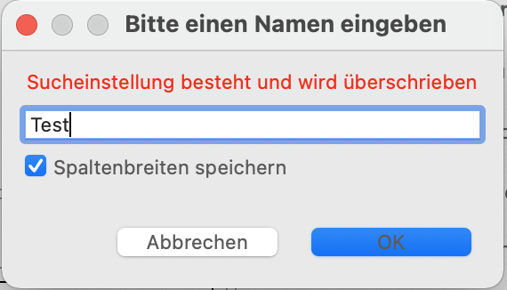

= Tastatur Navigation

== Tab- und Enter-Verhalten

Bei der Umsetzung des Tab-Verhaltens verwenden wir das Verhalten, dass Eclipse schon standardmäßig implementiert hat. Das Enter-Verhalten wird in einem Handler mit Key Binding umgesetzt. 
Wir haben uns aus folgenden Gründen gegen den TraverseListener entschieden:

- Wir möchten dem Benutzer ein für Ihn gewohntes Verhalten bieten. Er soll sich nicht umgewöhnen und es trägt zu einer einfacheren Bedienung der Anwendung bei.
- Es ist weniger Code für uns zum pflegen. Der Code wird durch Eclipse aktuell gehalten.
- Die Funktionalität des Verhaltens ist vielseitiger einsetzbar, da sie nicht an eine Klasse gebunden ist. Zum Beispiel, durch die Umsetzung des
Enter Verhaltens in einem Handler, können wir diesen von verschiedenen Stellen in der Anwendung aufrufen.

=== Preferences die das Tab- und Enter-Verhalten beeinflussen

EnterSelectsFirstRequired (ESFR) - Genau Beschreibung hier: xref:application.adoc#Nach dem Betätigen von ENTER wird das erste erforderliche Feld selektiert[EnterSelectsFirstRequired]

LookupEnterSelectsNextRequired (LESNR) - Genau Beschreibung hier: xref:application.adoc#Das Betätigen von Enter in einer Auswahlbox bewirkt die Übernahme des ausgewählten Wertes. Nach der Übernahme wird das nächste erforderliche Feld selektiert[LookupEnterSelectsNextRequired]

SelectAllControls (SAC) - Genau Beschreibung hier: xref:application.adoc#Aktiviert die Selektion aller möglichen Felder inkl. Registerkarte und Schaltflächen[SelectAllControls]

=== Tab-Verhalten

Da das Tab-Verhalten durch Eclipse vorgegeben ist, müssen wir nur noch die Tab-Reihenfolge bestimmen. Folgende Bedingungen gelten für die Tab-Reihenfolge:

- Dabei werden in den Sections nur die Felder in die Tab Liste hinzugefügt, die nicht Read Only sind.
- Wenn die Preference SelectAllControls gesetzt ist werden die Controls des Detail Parts ebenfalls der Tab-Reihenfolge hinzugefügt. Dies ermöglicht die Selektion der Toolbar und der Sections.
- Bei einem Grid selektiert Tab nur das erste Feld und springt danach ins nächste Element (Control/Field). Tab selektiert nicht die nächste Zelle aus der Tabelle. Innerhalb der Tabelle muss mit den Pfeiltasten navigiert werden.

Verhalten für die Eingabe von Tab:

|===
| *Eingabe* | *Verhalten*
| Tab | Benutzer springt ins nächste Feld.
| Shift + Tab | Benutzer springt ins vorherige Feld.
| Tab + SAC / Shift + Tab + SAC   = true | Beim Wechseln der Section/Page wird die Registerkarte der Section/Page selektiert
| Tab + SAC/ Shift + Tab + SAC  = false | Beim Wechseln der Section/Page wird die Registerkarte der Section/Page *nicht* selektiert
|===

Mit Tab verlässt man nie den ausgewählten Part. Wenn der Benutzer im letzten Feld Tab betätigt und SAC = false ist, wird das erste Feld im Part selektiert. Bei SAC = true wird das Label des Parts selektiert. Umgekehrt gilt das selbe. Wenn sich der Benutzer im erste Feld befindet und Shift + Tab 
betätigt, wird bei SAC = false das letzte Feld selektiert und bei SAC = true die Toolbar des Parts. Nach der Toolbar folgt das Label und danach wird das letzte Feld selektiert.

=== Enter-Verhalten

Die Eingabe von Enter wird mit einem Key-Binding im DetailPart erkannt und führt daraufhin die entsprechenden Handler aus. Dabei wir wie anschließend beschrieben vorgegangen:

- In der execute Methode des TraverseEnterHandlers holen wir uns zuerst das selektierte Feld. Bei einem LookupField schließen wir, falls offen, das PopupMenu.
- Danach wird das nächste leere Pflichtfeld, mit leeren WrittenText, ermittelt.
- Wenn ein Feld gefunden wurde wird es fokussiert. Falls kein gefunden wurde, beleibt der Benutzer im gleichen Feld.
- Nach der Ermittlung wird geprüft, ob der SaveDetailHandler enabled ist.
- Bei True wird dieser direkt ausgeführt. Bei False wird nichts gemacht.
- Bei einem Grid selektiert Enter das erste leere Pflichtfeld. Für Lookupvalues innerhalb der Tabelle gilt das Standardverhalten bei Lookups. 

Festgelegtes Verhalten für die Eingabe von Enter:

|===
| *Eingabe* | *Verhalten*
| Enter | Benutzer springt ins nächste Pflichtfeld.
| Enter + ESFR = true | Der benutzer springt ins erste nicht ausgefüllte Pflichtfeld.
| Enter + ESFR = false | Der benutzer springt ins nächste Pflichtfeld.
|===

=== Spezifisches Verhalten bei Mac

Für Mac gilt folgendes spezifisches Verhalten:

- Beim Mac kann die Selektion von Schaltflächen in den Systemeinstellungen aktiviert werden. Dafür muss unter Kurzbefehle in den Tastatureinstellungen der Haken bei "Bewege den Fokus mittels Tastaturnavigation zu Steuerelementen" gesetzt sein.

image::images/mac_activate_button_selection.png[Aktivierung der Button Selektion unter Mac,550,400]

- Standardverhalten für die Eingaben von Tab und Enter mit Modifier im Text Feld:

*Tab + Modifier:*
|===
|Ctrl + Tab | Benutzer bleibt im Feld und es wird ein Tab erstellt
|Alt + Tab | Benutzer springt ins nächste Feld. Es wird kein Tab erstellt.
|Cmd + Tab | Unter den geöffneten Apps zur zuletzt verwendeten wechseln.
|===

*Enter + Modifier:*
|===
| *Eingabe* | *Verhalten*
|Ctrl + Enter | Benutzer bleibt im Feld und es wird ein Zeilenumbruch erstellt
|Alt + Enter | Benutzer bleibt im Feld und es wird ein Zeilenumbruch erstellt
|Cmd + Enter | Benutzer bleibt im Feld es wird kein Zeilenumbruch erstellt, es kommt ein Fehlersound
|===

=== Spezifisches Verhalten bei Windows

Für Windows gilt folgendes spezifisches Verhalten:

- Standardverhalten für die Eingaben von Tab und Enter mit Modifier im Text Feld:

*Tab + Modifier:*
|===
| *Eingabe* | *Verhalten*
|Strg + Tab | Benutzer bleibt im Feld und es wird ein Tab erstellt.
|Alt + Tab | Windows spezifisches Verhalten wechseln zur letzten Anwendung.
|Win + Tab | Windows spezifisches Verhalten Übersicht aller offenen Fenster.
|===

*Enter + Modifier:*
|===
| *Eingabe* | *Verhalten*
|Strg + Enter | Benutzer bleibt im Feld und es wird ein Zeilenumbruch erstellt
|Alt + Enter | Benutzer bleibt im Feld und es wird kein Zeilenumbruch erstellt
|Win + Enter | Benutzer bleibt im Feld und es wird kein Zeilenumbruch erstellt
|===

== Key-Bindings

Die KeyBindings sind so gelegt, dass das selbe Verhalten gewährleistet ist, wie bei der Bedienung der Toolbar mit Maus.

=== Key-Bindings Window
|===
| *Eingabe* | *Verhalten*
| F1 | Help
| F3 | Load Data with MatchCode
| F4 | Die erste Zelle im SearchPart wird selektiert
| F5 | Der IndexPart wird aktualisiert
| F6 | Das erste Feld im DetailPart wird selektiert
| M1 + Q | Anwendung schließen
| M1 + R | Optimieren (Resize)
|===

=== Key-Bindings DetailPart
|===
| *Eingabe* | *Verhalten*
| CR | Nächstes leeres Pflichtfeld wird selektiert oder es wird gespeichert
| M1 + S | Speichern des aktuellen Datensatzes
| M1 + N | Detail leeren
| M1 + Z | Setzt die letzte Änderung im TexFeld zurück
|===

==== Key-Bindings Grid im DetailPart
|===
| *Eingabe* | *Verhalten*
| CTRL + M1 + N | Neue Zeile
| CTRL + M1 + D | Zeile löschen
| CTRL + M1 + H | Optimieren horizontal
| CTRL + M1 + V | Optimieren vertikal
|===

=== Key-Bindings SearchPart
|===
| *Eingabe* | *Verhalten*
| M1 + N | Alle Einträge aus den Suchzeilen werden gelöscht. Es werden alle Zeilen bis auf eine entfernt.
| M1 + D | Selektierte Zeile löschen (Delete)
| M1 + S | Default Suchkriterien speichern (Save)
| SHIFT + M1 + S | Suchkriterien speichern unter <Bezeichnung>
| SHIFT + M1 + D | Löschen von gespeicherten Suchkriterien
| M1 + L | Default Suchkriterien laden (Load)
| SHIFT + M1 + H | Optimieren (Resize Horizontal)
|===

Beim Speichern der Suchkriterien im SearchPart wird zwischen "Speichern" und "Speichern unter" unterschieden. Dabei speichert das normale "Speichern" nur 
das Default und überschreibt dieses und "Speichern unter" ermöglicht das Speichern unter einer anderen Bezeichnung.

*Beispiel für KeyBinding M1+S und SHIFT+M1+S:*

Benutzer gibt Suchkriterien ein, betätigt SHIFT+M1+S und speichert diese unter der Bezeichnung "Wochenstunden".

Später lädt er diese Suchkriterien und bearbeitet sie. Dabei speichert er diesmal mit M1+S. Dabei überschreibt er nicht die Suchkriterien mit der
Bezeichnung "Wochenstunden", sondern die Default Suchkriterien.

Um die bearbeiteten Suchkriterien wieder unter "Wochenstunden" zu speichern, betätigt der Benutzer SHIFT+M1+S und gibt "Wochenstunden" wieder als Bezeichnung an.
Über der Eingabe ändert sich der Text zu "Sucheinstellung besteht und wird überschrieben". Dies weist daraufhin, dass es schon ein Suchkriterium mit der Bezichnung 
exestiert und dieses überschrieben wird.

Sobald der Benutzer die Eingabe bestätigt, werden die neuen Suchkriterien unter "Wochenstunden" überschrieben.

