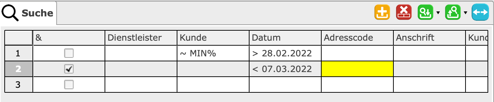
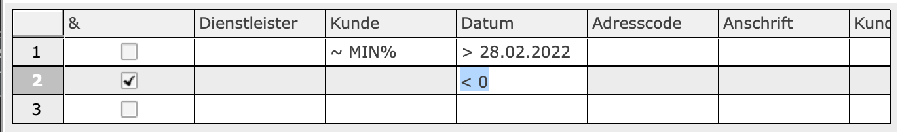

= SearchPart

Der SearchPart dient der Filterung und der Suche von Datensätzen. Dieser Bereich zeigt die gleichen Felder an wie der Indexbereich. Verschiedenen Kriterien können miteinander kombiniert werden. Dafür ist das erste Feld vorgesehen. Nach dem Laden der Suchkriterien wird das Ergebnis im Indexbereich dargestellt.

  

== Konzept

Ein Interpreter wird für jede Zelle des Suchbereichs registriert. Er ersetzt visuell den eingetragenen Wert. Bei der Darstellung werden die Felder, welche nicht gerade editiert werden, mit den Werten dargestellt. Das Feld welches gerade editiert wird, trägt noch den Inhalt der Eingabe.

  

In diesem Beispiel wird sichtbar, dass kein Datum als Eingabe erfolgte sondern entsprechende Kürzel oder Formeln.

=== Suchanfrage

Nach der Eingabe der Suchkriterien erfolgt mit `F5` oder dem `Laden` Button die erstellung einer Suchanfrage. Diese Anfrage setzt sich aus den Suchkriterien und der Spalten des Suchbereis zusammen. Als Basis für die Spalten des Suchbereis dient die *.XML Datei. Sie beschreibt in dem Tag `index-view` den darzustellenden Such- und Indexbereich.
[source,xml]
----
<index-view source="vWorkingTimeIndex2" index-report="auto">
		<column name="KeyLong" key="true" text="@WorkingTime.KeyLong" aggregate="COUNT">
			<number/>
		</column>
		<column name="EmployeeText" text="@WorkingTime.EmployeeText">
			<text/>
		</column>
		<column name="CustomerText" text="@WorkingTime.CustomerText">
			<text/>
		</column>
		<column name="ProjectText" text="@WorkingTime.ProjectText">
			<text/>
		</column>
		<column name="ServiceText" text="@WorkingTime.ServiceText">
			<text/>
		</column>
		<column name="BookingDate" text="@WorkingTime.BookingDate">
			<short-date/>
		</column>
		<column name="StartDate" text="@WorkingTime.StartDate">
			<short-time/>
		</column>
		<column name="EndDate" text="@WorkingTime.EndDate">
			<short-time/>
		</column>
		<column name="RenderedQuantity" text="@WorkingTime.RenderedQuantity" total="true">
			<number decimals="2"/>
		</column>
		<column name="ChargedQuantity" text="@WorkingTime.ChargedQuantity" total="true">
			<number decimals="2"/>
		</column>
		<column name="Description" text="@WorkingTime.Description">
			<text/>
		</column>
		<column name="ServiceContractText" text="@WorkingTime.ServiceContractText">
			<text/>
		</column>
		<column name="Assigned" text="@WorkingTime.Assigned">
			<boolean/>
		</column>
		<column name="LastDate" text="@WorkingTime.LastDate">
			<date-time/>
		</column>
		<column name="InvoiceText" text="@WorkingTime.InvoiceText">
			<text/>
		</column>
	</index-view>
----

Dieser XMl-Tag wird in ein Table-Objekt umgewandelt. Dieses Objekt dient als Basis und Datenschicht der NatTable. 
Jede `column` bildet eine Spalte aus der Tabelle ab. Ihr Datentyp wir durch die Eigenschaft definiert.

|===
|XMl-Eigenschaft   |Datentyp Java   
//-------------
|text   |String   
|short-date   |Instant   
|short-time   |Instant   
|long-time   |Instant   
|datetime   |Instant   
|number   |Integer  
|number + decimals > 0 |Double   
|boolean   |Boolean   
|===

Bei der Suchanfrage wird das Tabellenobjekt mit allen Spalten erstellt. Danach werden leere Zeilen eingefügt. Die Anzahl der leeren Zeilen entspricht der Anzahl an Zeilen aus den Suchkriterien. Die letzte leere Zeile wird dabei ignoriert.
Die zu interpretiernden Werte aus den Feldern werden in die zugehörigen leeren Zeilen geschrieben.
Die Operatoren vor den Werten werden ebenfalls mit in die Zelle eingetragen. Sie werden vom CAS verarbeitet.
Nachdem die Tabelle vollständig erstellt wurde, wird dieses Objekt als Anfrage mit einem HttpRequest an den CAS versendet. Die asynchrone Antwort enthält ebenfalls ein Table-Objekt. Dieses wird von dem Indexbereich eingelesen und dargestellt.

== Operatoren
Für die folgenden Felder wird ein Operator verwendet, der aus einem Feldinhalt einen Wert interpretiert. 

|===
|Eingabe   |Interpretation   |Darstellung beim Verlassen   
//----------------------
|`>1`   |`>` + der 1. des aktuellen Monats   | > 01.12.2020    
|===

Die Operatoren (mit Außnahme der Wildcards) müssen als Erstes in dem Feld eingetragen werden und können mit einem Lehrzeichen von der eigentlichen Eingabe getrennt werden.
Für die folgenden Felder kann ein Operator eingesetzt werden: 

==== Zahlenfelder
Bei einem Zahlenfeld können folgende Operatoren zum Einsatz kommen: `>`, `<`, `=`, `>=`, `\<=`, `<>`, `null`, `!null`.

==== Datums-, Zeit-, DateTimeFelder
Bei einem Datums-, Zeit-, DateTimeFelder können folgende Operatoren zum Einsatz kommen: `>`, `<`, `=`, `>=`, `\<=`, `<>`, `null`, `!null`.

==== Textfelder
Bei einem Textfelder können folgende Operatoren zum Einsatz kommen: `%`, `_`, `=`, `<>`, `null`, `!null`, `~`, `!~`.
 
 * `%` der Wildcard-Operator steht für einen beliebigen Text
 * `_` steht für eine einzelnes beliebiges Zeichen
 
|===
|Eingabe   |Interpretation   |Darstellung beim Verlassen   
//----------------------
|`%burg`   |`%` + burg   |`%burg`   
|`%varo%`   |`%` + varo + `%`|`%varo%`
|`% burg`   |`%` + ' ' + burg   |`% burg`
|===

In diesem Beispiel werden alle Einträge gefunden, die mit dem Text: `burg` enden.
Zusätzlich werden alle Datensätze gesucht, die `varo` enthalten. 

==== '>' Größer
Es werden alle Datensätze gesucht, deren Wert größer als der angegebene ist.

==== '<' Kleiner
Es werden alle Datensätze gesucht, deren Wert kleiner als der angegebene ist.

==== '=' Gleich
Es werden alle Datensätze gesucht, deren Wert genau dem angegebenen entspricht.

==== '>=' Größer-Gleich
Es werden alle Datensätze gesucht, deren Wert größer oder gleich dem angegebene ist.

==== '\<=' Kleiner-Gleich
Es werden alle Datensätze gesucht, deren Wert kleiner oder gleich dem angegebene ist.

==== '<>' Ungleich
Es werden alle Datensätze gesucht, deren Wert nicht gleich dem angegebene ist.

==== 'null' Nichts (kein Wert)
Es werden alle Datensätze gesucht, bei denen in diesem Feld kein Wert eingetragen wurde

==== '!null' nicht Nichts (einen Wert)
Es werden alle Datensätze gesucht, bei denen in diesem Feld ein Wert eingetragen wurde

==== '~' Like Operator (Ählichkeitssuche)
Es werden alle Datensätze gesucht, bei denen der Wert des Feldes mit dem Muster übereinstimmt.
Das Muster kann die Wildcards `%` und `?` enthalten.

==== '!~' Not Like Operator
Es werden alle Datensätze gesucht, bei denen der Wert des Feldes nicht mit dem Muster übereinstimmt.
Das Muster kann die Wildcards `%` und `?` enthalten.

== Verhalten der Felder

Die Eingabe in Datums- und Zeitfelder wird wie link:https://github.com/minova-afis/aero.minova.rcp/edit/master/bundles/aero.minova.rcp.rcp/README.adoc[beschrieben] umgewandelt.

Wenn der Nutzer keinen Operator einträgt, wird in Datums-, Zeit-, DateTime- und Zahlenfeldern automatisch ein `=` eingefügt.
In Textfeldern ist der Defaultoperator `~`.
Ist in einem Textfeld zudem kein Wildcard-Operator vorhanden, wird automatisch `%` am Ende des Strings hinzugefügt. 
Damit wird bei der Eingabe von `ja` der Name `janiak` gefunden.
Es wird also sichergestellt, dass immer ein Operator vorhanden ist.

Trägt der Nutzer `null` oder `!null` ein, werden alle weiteren Angaben verworfen.

Wenn ein Nutzer in ein Feld klickt, in das bereits etwas eingetragen wurde, erscheint dort wieder der ursprüngliche Inhalt.
Die Eingabe von `12` in ein Datumsfeld wird als `= 01.02.2021` dargestellt.
Wird dieses Feld wieder ausgewählt, erscheint dort wieder `12`.

== Aufruf des CAS

Daten werden an das CAS in folgendem Format übertragen:

`f-=-s-Beispiel`

Das `f` steht hier für Filter.
Als nächstes folgt der Operator.
Dann kommt der Datentyp der eigentlichen Eingabe.
Diese sind:

* `n`: Integer
* `d`: Double
* `s`: String
* `i`: Instant
* `z`: ZonedDateTime
* `b`: Boolean

Zuletzt kommen die Daten.
Die Daten von Boolean-Feldern werden ohne Filter übertragen (z.B. `b-true`).

Bei Datums und Zeitangaben wir immer der String als SQL-Instant übertragen.
`{ts '2020-12-31 12:30:00'}` ist die entsprechende Konstante. 
Bei Feldern mit Zeit, wird als Datum immer der 01.01.1900 angegeben.
Als Zeitzone ist UTC einzustellen.
Die Zeitzone der Anwendung kann davon abweichen.
