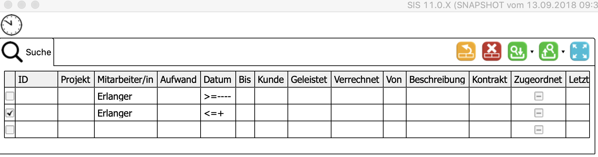
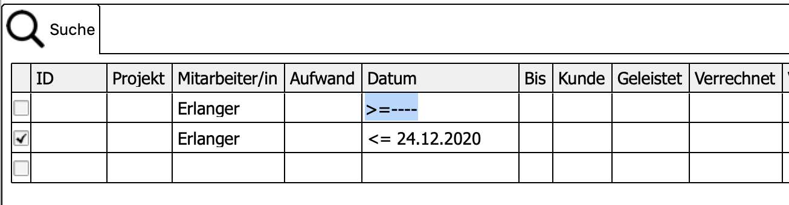

= SearchPart
Der SearchPart dient der Filterung und der Suche von Datensätzen. Dieser Bereich zeigt die gleichen Felder an wie der Indexbereich. Verschiedenen Kriterien können miteinander kombiniert werden. Dafür ist das erste Feld vorgesehen. Nach dem Laden der Suchkriterien werden wird das Ergebnis im Indexbereich dargestellt.

  

== Konzept

Ein Interpreter wird für jede Zelle des Suchbereichs registriert. Er ersetzt visuell den eingetragenen Wert. Bei der Darstellung werden die Felder, welche nicht gerade editiert werden, mit den Werten dargestellt. Das Feld welches gerade editiert wird, trägt noch den Inhalt der Eingabe.

  

In diesem Beispiel wird sichtbar, dass kein Datum als eingabe erfolgte sondern entsprechende Kürzel order Formeln.

=== Suchanfrage

Nach der Eingabe der Suchkriterien erfolgt mit `F5` oder dem `Laden` Button die erstellung einer Suchanfrage. Diese Anfrage setzt sich aus den Suchkriterien und der Spalten des Suchbereis zusammen. Als Basis für die Spalten des Suchbereis dient die *.XML Datei. Sie beschreibt in dem Tag `index-view` den darzustellenden Such- und Indexbereich.
[source,xml]
----
<index-view source="vWorkingTimeIndex2" index-report="auto">
		<column name="KeyLong" key="true" text="@WorkingTime.KeyLong" aggregate="COUNT">
			<number/>
		</column>
		<column name="EmployeeText" text="@WorkingTime.EmployeeText">
			<text/>
		</column>
		<column name="CustomerText" text="@WorkingTime.CustomerText">
			<text/>
		</column>
		<column name="ProjectText" text="@WorkingTime.ProjectText">
			<text/>
		</column>
		<column name="ServiceText" text="@WorkingTime.ServiceText">
			<text/>
		</column>
		<column name="BookingDate" text="@WorkingTime.BookingDate">
			<short-date/>
		</column>
		<column name="StartDate" text="@WorkingTime.StartDate">
			<short-time/>
		</column>
		<column name="EndDate" text="@WorkingTime.EndDate">
			<short-time/>
		</column>
		<column name="RenderedQuantity" text="@WorkingTime.RenderedQuantity" total="true">
			<number decimals="2"/>
		</column>
		<column name="ChargedQuantity" text="@WorkingTime.ChargedQuantity" total="true">
			<number decimals="2"/>
		</column>
		<column name="Description" text="@WorkingTime.Description">
			<text/>
		</column>
		<column name="ServiceContractText" text="@WorkingTime.ServiceContractText">
			<text/>
		</column>
		<column name="Assigned" text="@WorkingTime.Assigned">
			<boolean/>
		</column>
		<column name="LastDate" text="@WorkingTime.LastDate">
			<date-time/>
		</column>
		<column name="InvoiceText" text="@WorkingTime.InvoiceText">
			<text/>
		</column>
	</index-view>
----

Dieser XMl-Tag wird in ein Table-Objekt umgewandelt. Dieses Objekt dient als Basis und Datenschicht der NatTable. 
Jede `column` bildet eine Spalte aus der Tabelle ab. Ihr Datentyp wir durch die eigenschaft definiert.

|===
|XMl-Eigenschaft   |Datentyp Java   
//-------------
|text   |String   
|short-date   |Instant   
|short-time   |Instant   
|long-time   |Instant   
|datetime   |Instant   
|number   |Integer  
|number + decimals > 0 |Double   
|boolean   |Boolean   
|===

Bei der Suchanfrage wird das Tabellenobjekt mit alle Spalten erstellt. Danach werden leere Zeilen erstellt. Die Anzahl der leeren Zeilen entspricht der Anzahl an unterscheidlichen, nicht leeren zeilen aus der Suchanfrage.
Die zu interpretiernden Werte aus den Feldern werden in die zugehörigen leeren Zeilen geschrieben. Nachdem die Tabelle vollständig erstellt wurde wird dieses Objekt als Anfrage in ein HttpRequest an den CAS versendet. 

== Interpreter
Für die folgenden Felder wird ein Interpreter verwendet, der aus einem Feldinhalt einen Wert interpretiert. 

|===
|Eingabe   |Interpretation   |Darstellung beim Verlassen   
//----------------------
|`>1`   |`>` + der 1. des Monats im Dezember   | > 01.12.2020    
|===

Für die folgenden Felder kann ein Interpreter eingesetzt werden: 

==== Zahlenfelder
Bei einem Zahlenfeld können folgende Operatoren zum Einsatz kommen: `>`, `<`, `=`, `<>`, `null`.

==== Datums-, Zeit-, DateTimeFelder
Bei einem Zahlenfeld können folgende Operatoren zum Einsatz kommen: `>`, `<`, `=`, `<>`, `null`.

==== Textfelder
Bei einem Zahlenfeld können folgende Operatoren zum Einsatz kommen: `%`, `?`, `=`, `<>`, `null`.
 * `%` der Weildcard-Operator steht für einen beliebigen Text.
 
|===
|Eingabe   |Interpretation   |Darstellung beim Verlassen   
//----------------------
|`%burg`   |`%` + burg   |`*burg`   
|`%varo%`   |`%` + varo + `%`|`*varo*`   
|===

In diesem Beispiel werden alle Einträge gefunden, die mit dem Text: `burg` enden.
Zusätzlich werden alle Datensätze gesucht, die `varo` enthalten. 
