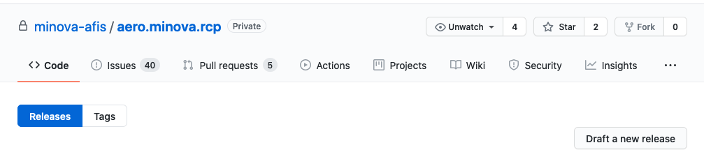
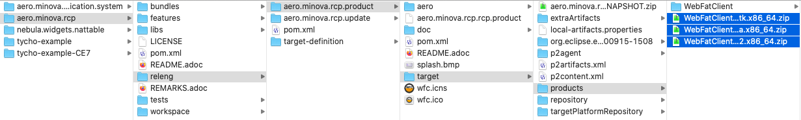

= Release Prozess

Um die Anwedung in der Version 12.0.0 intern in den Umlauf zu bringen wurde der "release-prozess" intern umgeändert. 
Ausgegangen wird von einem Stand des Repositories, von dem die WFC - Anwendung fehlerfrei gebaut werden kann und alle Tests durchlaufen. 

== Tag erstellen
Um den Stand vom dem die Anwendung gebaut wurde sind mehrere Schritte notwendig.

=== Version inkrementieren
Je nach Änderung und Erweiterungen wir die Versionsnummer der Anwendung angepasst. Bis zur ersten Auslieferung wollen wir zunächst nur das Patch-Level inkrementieren. Um auf dem aktuellen Repository die Version in allen PLugIns automatisch zu setzen kann folegnder Befehl verwendet werder. 
In dem Verzeichnis: aero.minova.rcp wird folgendes auf der Konsole ausgeführt:

----
mvn org.eclipse.tycho:tycho-versions-plugin:set-version -DnewVersion=12.0.2.qualifier -Dtycho.mode=maven
----

Nach der Ausführung werden alle PlugIns mit der Version 12.0.2 upgedated. 
Danach wird die Anwendung nochmals gebaut, damit die Version auch in dem Release eingetragen wird.

In dem Verzeichnis: aero.minova.rcp wird folgendes auf der Konsole ausgeführt:
----
mvn clean verify
----

*Danach das einchecken nicht vergessen!*

=== Tag im Eclipse erstellen

Ein Tag des aktuellen Standes kann ganz einfach über das Eclipse erstellt werden. Dafür wechselt man in die GIT Perspektive.
Mit einem rechtsklick auf Tags öffnet sich ein Menu in dem "create Tag" ausgewählt wird.

image::doc/images/eclipse-create-tag.png[]

Die Namensgebung folgt dann einer bestimmten Konvention: *vMajor.Minor.Patch*
So kann der Tag gut sortiert und wiedergefunden werden.

Die Tag Message sollte einen Überblick über die Änderungen / Erweiterungen geben. 

=== GitHub Release anlegen

Nachdem der Tag angelegt und gepushed wurde kann man diesen auch über GitHub ansehen. link:https://github.com/minova-afis/aero.minova.rcp/tags[aero.minova.rcp Tags]. 
Dort wählen wir Releases aus und erstellen einen neuen Release "Draft a new Release" 

Hier wird der erstellte Tag aus Eclipse ausgewählt und in Tag version eingetragen. Zusätzlich werden die Felder mit sinnvollen Werten gefüllt.

=== Hochladen auf ACode
Wir haben uns vorerst darauf geeinigt, die 3 verschiedenen Anwendngen auf den ACode zu stellen. 

Diese 3 Dateien werden auf den acode in das Verzeichnis Stundenerfassung/WFC App/ gelegt.

image::doc/images/acode-zipfiles.png[]