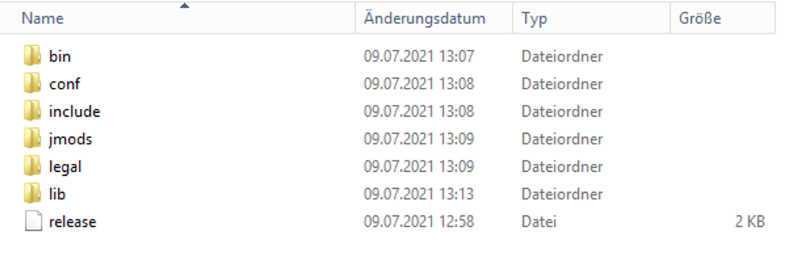

= Release Prozess

Um die Anwedung in der Version 12.0.0 intern in den Umlauf zu bringen wurde der Release Prozess intern umgeändert. 
Ausgegangen wird von einem Stand des Repositories, von dem die WFC - Anwendung fehlerfrei gebaut werden kann und alle Tests durchlaufen. 

Mit dem automatisierten Workflow von Github kann die Anwendung gebaut, getagged, und released werden.

Hierfür einfach unter ``Actions -> Tag and Release Workingtime - PlugIn`` den Workflow mit der neuen Versionsnummer anstoßen.

image::doc/images/automaticRelease.png[]

In dem Release sind die gezippten Anwendungen für Windows, Mac und Linux enthalten.
Anschließend muss der neue Release nur noch mit entsprechenden Updatenotes versehen werden.

=== JRE Versionen bereit stellen

Damit wir nicht ständig die JRE Versionen in das Anwednungsverzeichnis kopieren müssen, legen wird unmittelbar nach dem erstellen der Anwendungen die passenden Versionen in die ".zip" Dateien. Dieser Prozess wird für macOS und Windows durchgeführt. Verwendet wird die Version: *Java Runntime 11.0.7+10-LTS*

==== JRE für macOS
Hier muss eine lokal gebaute Version genutzt werden, da MacOS es nicht erlaubt, aus dem Internet geladene Anwendungen auszuführen. 
Mittels rechtsklick wird auf das gebaute Anwednungsfragment geklickt. Paketinhalt öffnen.
Danach kopiert man den JRE Ordner parallel in das geöffnete Verzeichnis. Man sollte darauf achten, dass der jre Ordner kleingeschrieben ist und die Struktur aufweist die in dem unteren Bild dargestellt wird. 

image::doc/images/product-zipfiles_jre.png[]

image::doc/images/product-zipfiles_jre1.png[]

Danach kann der Name der "Eclispe.app" geändert werden. Zum Schluss wir noch eine komprimierte Datei aus der "xxx.app" erstellt. 

==== JRE für Windows
Das ".zip" File aus dem Release wird unter einem Windows-File-System entpackt. Anschlißend kopiert man das Passende JRE direkt in das Anwendungsverzeichnis.

image::doc/images/product-zipfiles_jre_windows.png[]

Danach wird das gesamte Verzeichnis wieder komprimiert. 

=== Hochladen auf ACode
Wir haben uns vorerst darauf geeinigt, die 3 verschiedenen Anwendngen auf den ACode zu stellen.
(Verzeichnis: _/aero.minova.rcp/releng/aero.minova.rcp.product/target/products/_)

image::doc/images/product-zipfiles.png[]

Diese 3 Dateien werden auf den ACode in das Verzeichnis _Stundenerfassung/WFC App/_ gelegt.

image::doc/images/acode-zipfiles.png[]

Von hier können sich nun alle die neue Anwendung runterladen und anfangen die Stunden zu erfassen.
